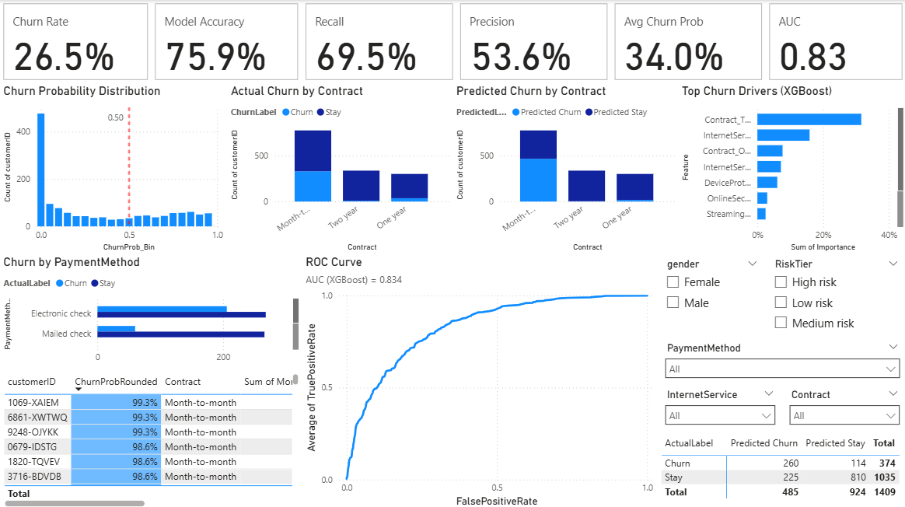
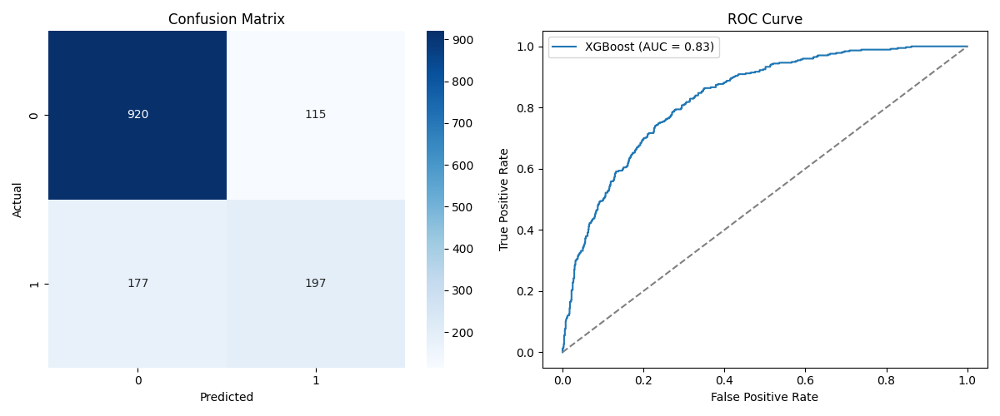
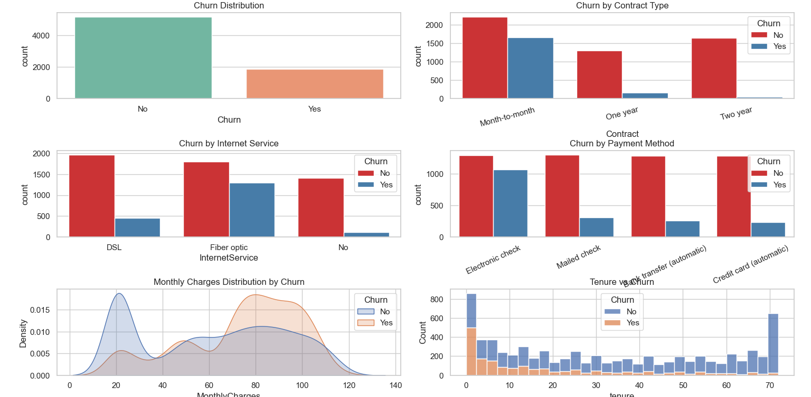
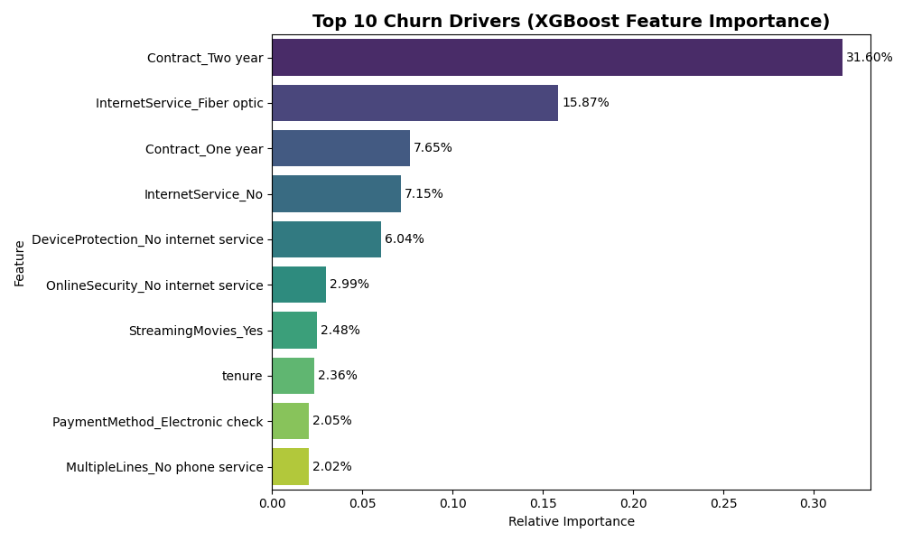

# FUTURE_ML_02 – Churn Prediction System  

## 📌 Project Overview  
This project was completed as part of the **Future Interns Machine Learning Internship**.  
The goal was to build a **Churn Prediction System** that identifies customers likely to leave (churn) based on demographic, contract, and service usage data.  

The project combines **data preprocessing, machine learning, and business visualization** into one end-to-end solution.  

---

## 🛠 Steps Performed  
1. **Data Preparation**  
   - Used **Telco Customer Churn dataset** (7,043 records, 21 features).  
   - Cleaned missing values in `TotalCharges`, encoded categorical variables, scaled numeric features.  

2. **Exploratory Data Analysis (EDA)**  
   - Visualized churn distribution (~26.5%).  
   - Key patterns: higher churn in **month-to-month contracts**, **electronic check payments**, and **newer customers**.  

3. **Model Training & Evaluation**  
   - **Logistic Regression** (baseline).  
   - **Random Forest** (ensemble).  
   - **XGBoost** (advanced, with class imbalance handling).  
   - Evaluated using **Accuracy, Precision, Recall, F1, ROC-AUC**.  

4. **Churn Drivers (Feature Importance)**  
   - Used XGBoost to extract top churn drivers.  
   - Key factors: **Contract Type, Tenure, Payment Method, Monthly Charges**.  

5. **Predictions & Export**  
   - Generated churn probability for each customer.  
   - Exported predictions as CSV for dashboard integration.  

6. **Power BI Dashboard**  
   - KPIs: Churn Rate, Model Accuracy, AUC Score.  
   - ROC Curve (imported from Python export).  
   - Confusion Matrix (model performance).  
   - Churn by **Contract / Payment Method**.  
   - Table of **Top At-Risk Customers**.  

---

## 📊 Model Performance (Test Data)
| Model               | Accuracy | Precision | Recall | F1 Score | ROC-AUC |
|----------------------|----------|-----------|--------|----------|---------|
| Logistic Regression | 0.804    | 0.657     | 0.548  | 0.598    | 0.843   |
| Random Forest       | 0.788    | 0.628     | 0.492  | 0.552    | 0.829   |
| XGBoost             | 0.793    | 0.631     | 0.527  | 0.574    | 0.834   |

---

## 📂 Repository Structure  
```text
FUTURE_ML_02/
│
├── code/
│   ├── churn_model.py                         # main script (LogReg, RF, XGB, exports)
│   └── feature_importance.py                  # churn drivers plot
│
├── data/
│   ├── WA_Fn-UseC_-Telco-Customer-Churn.csv   # raw dataset
│   ├── clean_telco.csv                        # cleaned dataset
│   ├── churn_predictions_full.csv             # predictions with features
│   └── roc_table.csv                          # ROC curve points
│
├── dashboard/  
|   ├── churn_dashboard.pbix                   # Power BI dashboard  
│   ├── churn_visuals.png                      # EDA dashboard (6-in-1 plot)
│   ├── mat_roc.png                            # ROC/Confusion Matrix
│   ├── churn_drivers.png                      # feature importance
│   └── dashboard_screenshots/ 
│ 
├── docs/                                      # Documentation
│   │── README.md
│   └── requirements.txt
```

---

## 🚀 Tools Used  
- **Python (Scikit-learn, XGBoost, Pandas, Matplotlib)**  
- **Power BI**  
- **Excel/CSV**  

---

## 📸 Dashboard Preview  





---

## 🔗 Internship Context  
This project is **Task 2** of the **Future Interns – Machine Learning Internship**.  
